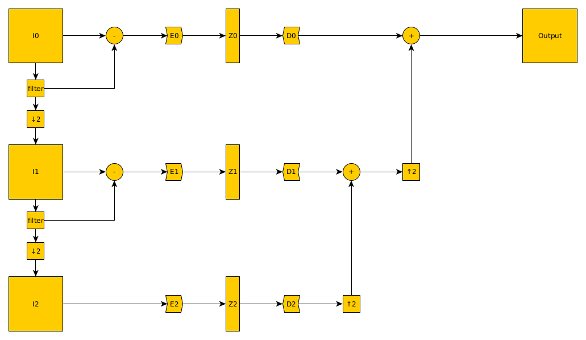
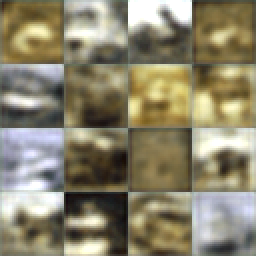
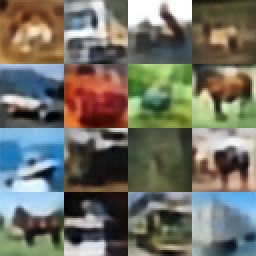

# Multiscale Variational Autoencoder

Building a multiscale variational autoencoder (m-vae).

It is similar to a wavelet decomposition with a learnable encoding in the middle.

It creates different scale representation of an image and then encodes it into z-domain. 

The downscaled versions are used to learn high level features and the higher level versions encode minute details. 

The model allows to create as much as log_2(input_size) numbers of levels.



I intend to use this m-vae as a building block for Classifiers, Fuzzers, Anomaly Detection and more.

## Tasks
- [x] Build basic model
- [x] Abstract Encoding and Decoding
- [x] CIFAR10 [notebook](notebooks/cifar10_notebook.ipynb)
- [ ] MNIST notebook
- [ ] Generator model
- [ ] Classifier model
- [ ] Anomaly detection

## CIFAR10 Autoencoder

Trained on the ```CIFAR10``` dataset to recreate images for 10 epochs.


### Original / Recreation comparison

Cifar10 - Epoch 1



Cifar10 - Epoch 150




