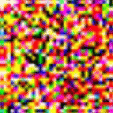
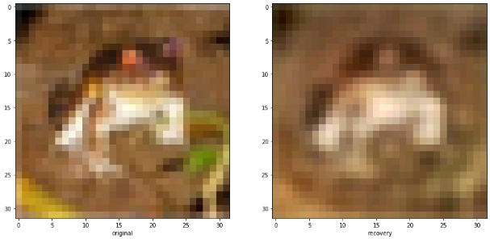
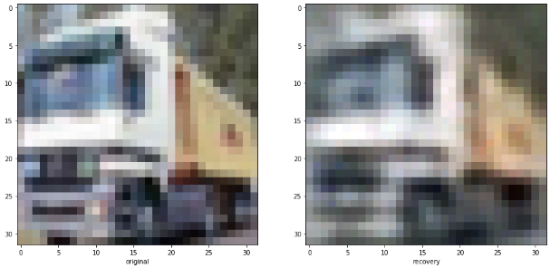
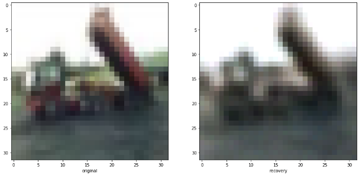

# Multiscale Variational Autoencoder

Building a multiscale variational autoencoder (m-vae).

It is similar to a wavelet decomposition with a learnable encoding in the middle.


I intend to use this m-vae as a building block for Classifiers, Fuzzers, Anomaly Detection and more.

## Tasks
- [x] Build basic model
- [x] Abstract Encoding and Decoding
- [x] CIFAR10 notebook
- [ ] MNIST notebook
- [ ] Generator model
- [ ] Classifier model
- [ ] Anomaly detection

## CIFAR10 Autoencoder

Trained on the ```CIFAR10``` dataset to recreate images for 10 epochs.



### Original / Recreation comparison







